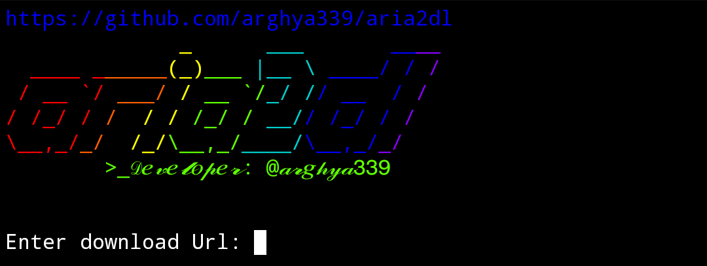
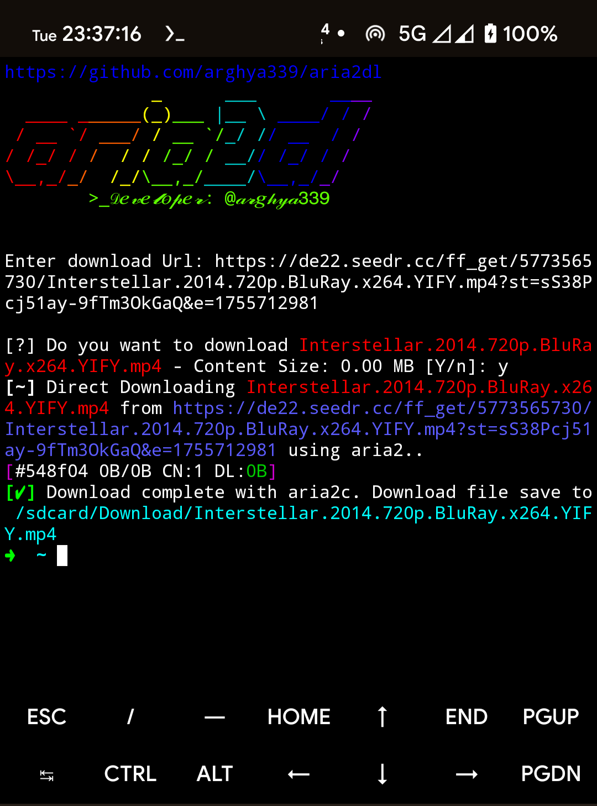

<h1 align="center">aria2dl</h1>
<p align="center">
aria2 downloader
<br>
<br>

<br>

## Purpose
- This script automates the process of downloading file using [aria2](https://github.com/aria2/aria2).

## Supported website
- [github.com](https://github.com/)
- [seedr.cc](https://seedr.cc/)

## Prerequisites
- Android device with working internet connection.

## Usage
### Android
  - Open [Termux](https://github.com/termux/termux-app/releases/) and type following command then press `Enter` key twice:
  ```sh
  pkg update && pkg install --only-upgrade apt bash -y
  ```
  run the script with the following command:
  ```sh
  curl --progress-bar -o "$HOME/.aria2dl.sh" "https://raw.githubusercontent.com/arghya339/aria2dl/main/Termux/aria2dl.sh" && bash "$HOME/.aria2dl.sh"
  ```
  Run aria2dl with these commands in Termux:
  ```
  aria2dl
  ```
> [!NOTE]
> This script was tested on an arm64-v8a device running Android 14 with Termux v0.118.3 with bash v5.2.37(1).

## How it works (_[Demo on YouTube](https://youtube.com/)_)



## Devoloper info
- Powered by [aria2c](https://github.com/aria2/aria2)
- Developer: [@arghya339](https://github.com/arghya339)

## ⚡ The Ultimate Download Accelerator